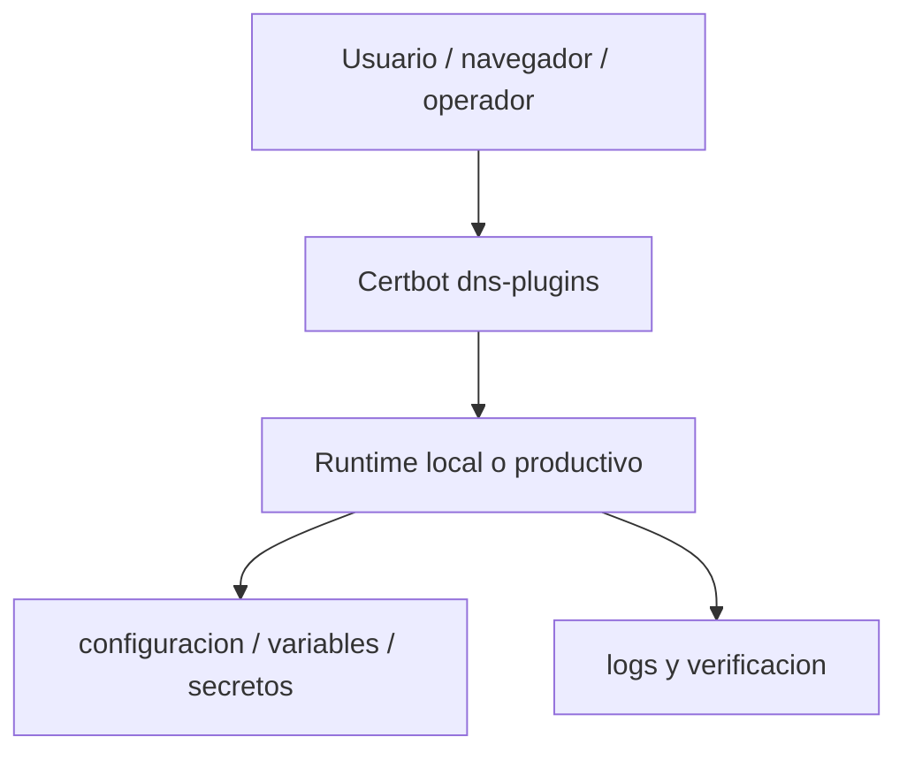
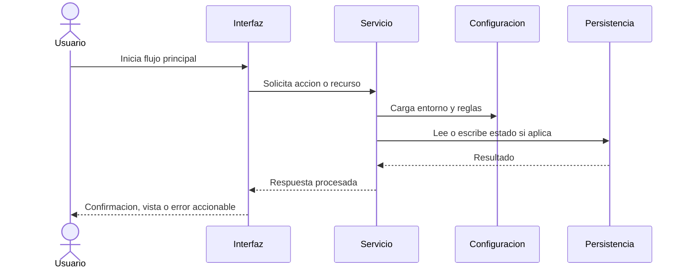

# Certbot dns-plugins

This file contains info about available Certbot DNS plugins.
This only works for plugins which use the standard argument structure, so:
--authenticator <plugin-name> --<plugin-name>-credentials <FILE> --<plugin-name>-propagation-seconds <number>

File Structure:

```json
{
  "cloudflare": {
    "display_name": "Name displayed to the user",
    "package_name": "Package name in PyPi repo",
    "version_requirement": "Optional package version requirements (e.g. ==1.3 or >=1.2,<2.0, see https://www.python.org/dev/peps/pep-0440/#version-specifiers)",
    "dependencies": "Additional dependencies, space separated (as you would pass it to pip install)",
    "credentials": "Template of the credentials file",
    "full_plugin_name": "The full plugin name as used in the commandline with certbot, e.g. 'dns-njalla'"
  },
  ...
}
```

---

## Diagramas Mermaid

### Vista general



### Flujo de operacion


