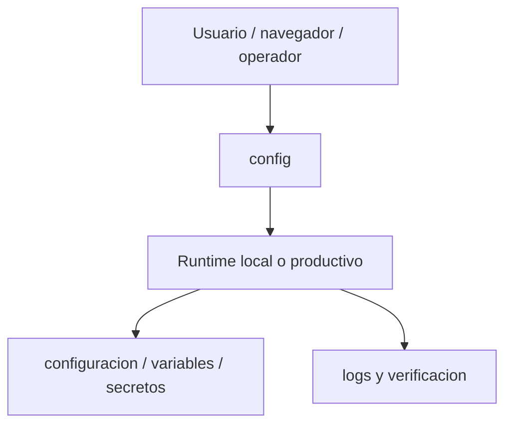
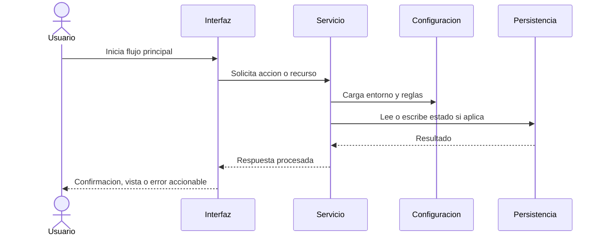

These files are use in development and are not deployed as part of the final product.

---

## Diagramas Mermaid

### Vista general

```mermaid
flowchart TD
    Client["Usuario / navegador / operador"] --> Entry["config"]
    Entry --> Runtime["Runtime local o productivo"]
    Runtime --> Config["configuracion / variables / secretos"]
    Runtime --> Logs["logs y verificacion"]
```

### Flujo de operacion

```mermaid
sequenceDiagram
    actor User as Usuario
    participant UI as Interfaz
    participant Service as Servicio
    participant Config as Configuracion
    participant Store as Persistencia

    User->>UI: Inicia flujo principal
    UI->>Service: Solicita accion o recurso
    Service->>Config: Carga entorno y reglas
    Service->>Store: Lee o escribe estado si aplica
    Store-->>Service: Resultado
    Service-->>UI: Respuesta procesada
    UI-->>User: Confirmacion, vista o error accionable
```
