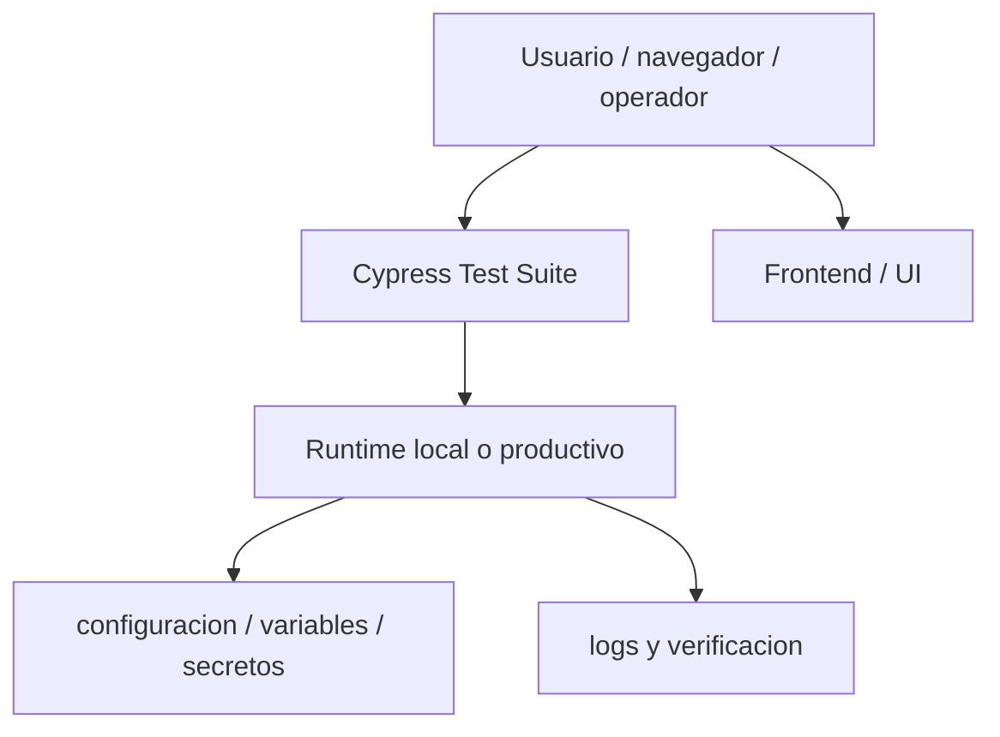
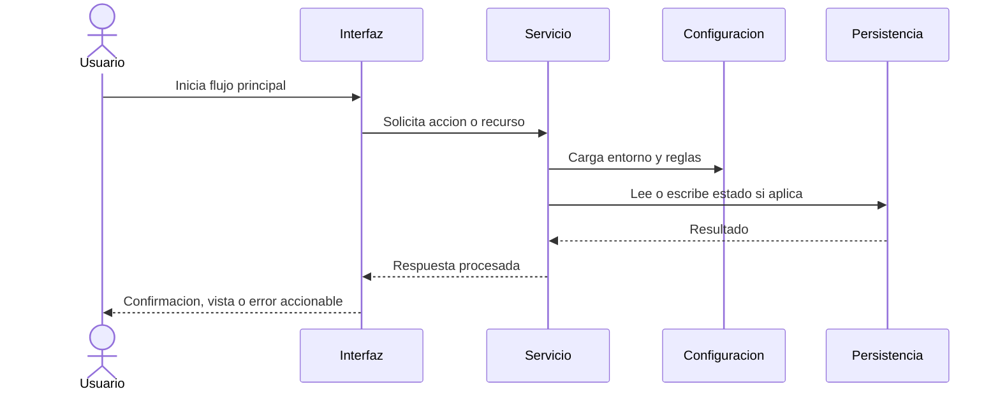

# Cypress Test Suite

## Running Locally

```
cd nginxproxymanager/test
yarn install
yarn run cypress
```

## VS Code

Editor settings are not committed to the repository, typically because each developer has their own settings. Below is a list of common setting that may help,
so feel free to try them or ignore them, you are a strong independent developer. You can add settings to either "user" or "workspace" but we recommend using
"workspace" as each project is different.

### ESLint

The ESLint extension only works on JavaScript files by default, so add the following to your workspace settings and reload VSCode.

```
"eslint.autoFixOnSave": true,
"eslint.validate": [
	{ "language": "javascript", "autoFix": true },
	"html"
]
```

> NOTE: If you've also set the editor.formatOnSave option to true in your settings.json, you'll need to add the following config to prevent running 2 formatting
> commands on save for JavaScript and TypeScript files:

```
"editor.formatOnSave": true,
"[javascript]": {
	"editor.formatOnSave": false,
},
"[javascriptreact]": {
	"editor.formatOnSave": false,
},
"[typescript]": {
	"editor.formatOnSave": false,
},
"[typescriptreact]": {
	"editor.formatOnSave": false,
},
```

---

## Diagramas Mermaid

### Vista general



### Flujo de operacion


